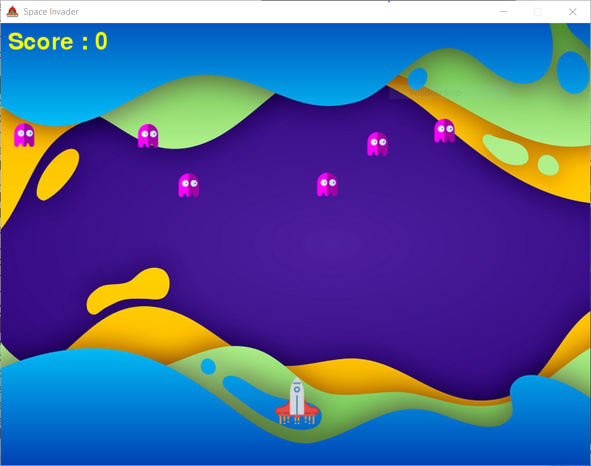
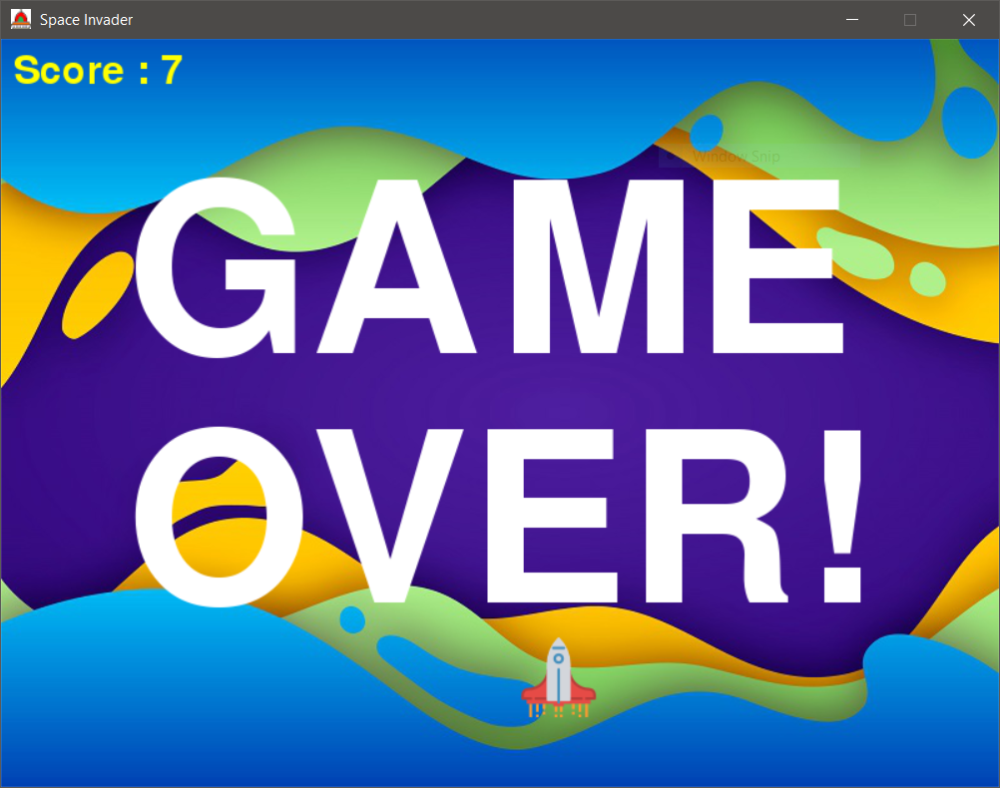

# Space_Shooter

  A playable SpaceShooter game.
  
# Language 
  1. Python
  
# How to use?

Open the main.py file. Either directly or using command line -

             >\ py main.py

Press Enter to start the game.

# Screenshots -

